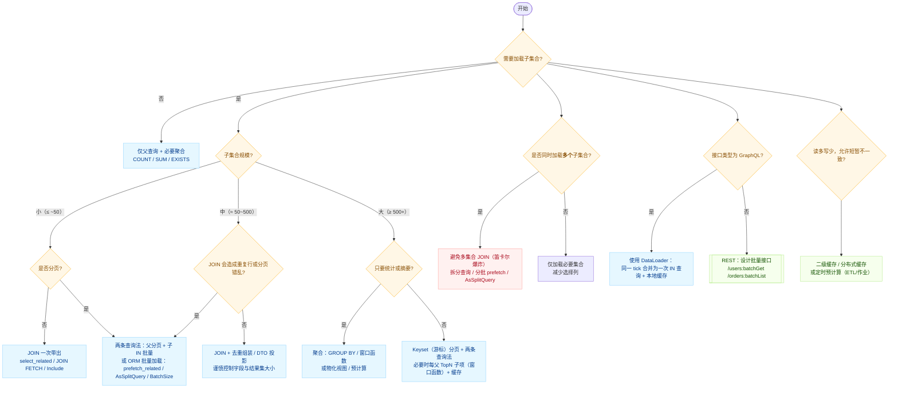

聚簇索引: 主键索引 + 完整行数据

索引键部分： 主键字段
数据部分：表的所有字段数据
存储方式：数据按照主键顺序物理存储
查询优势：主键查询无需回表，性能最佳


N+1问题:



存储过程:
# MySQL 存储过程详解

存储过程（Stored Procedure）是预编译的SQL语句集合，存储在数据库中并可以被重复调用执行的程序单元。

## 📚 基础概念

### 什么是存储过程？
存储过程是一组为了完成特定功能的SQL语句集，经编译后存储在数据库中，通过指定存储过程的名字并给出参数（如果该存储过程带有参数）来调用执行它。

### 优点
- **性能优势**：预编译，执行速度快
- **代码复用**：一次编写，多次调用
- **安全性**：减少SQL注入风险
- **网络流量**：减少客户端与服务器通信
- **业务逻辑集中**：复杂逻辑封装在数据库层

### 缺点
- **可移植性差**：不同数据库语法不同
- **调试困难**：调试工具相对有限
- **版本控制**：难以进行版本管理
- **业务逻辑分散**：部分逻辑在数据库层

## 🔧 基本语法

### 创建存储过程
````sql
DELIMITER //
CREATE PROCEDURE procedure_name (
    [IN|OUT|INOUT] parameter_name parameter_type,
    ...
)
BEGIN
    -- 存储过程体
    SQL语句;
END //
DELIMITER ;
````

### 调用存储过程
````sql
CALL procedure_name(参数列表);
````

### 删除存储过程
````sql
DROP PROCEDURE IF EXISTS procedure_name;
````

## 📋 参数类型

### IN 参数（输入参数）
````sql
DELIMITER //
CREATE PROCEDURE GetUserById(IN user_id INT)
BEGIN
    SELECT * FROM t_user_info WHERE id = user_id;
END //
DELIMITER ;

-- 调用
CALL GetUserById(1);
````

### OUT 参数（输出参数）
````sql
DELIMITER //
CREATE PROCEDURE GetUserCount(OUT total_count INT)
BEGIN
    SELECT COUNT(*) INTO total_count FROM t_user_info;
END //
DELIMITER ;

-- 调用
CALL GetUserCount(@count);
SELECT @count;
````

### INOUT 参数（输入输出参数）
````sql
DELIMITER //
CREATE PROCEDURE DoubleValue(INOUT num INT)
BEGIN
    SET num = num * 2;
END //
DELIMITER ;

-- 调用
SET @value = 5;
CALL DoubleValue(@value);
SELECT @value; -- 结果为10
````

## 🎯 控制流语句

### IF-ELSE 条件判断
````sql
DELIMITER //
CREATE PROCEDURE CheckUserStatus(IN user_id INT)
BEGIN
    DECLARE user_status INT DEFAULT 0;
    
    SELECT is_disable INTO user_status 
    FROM t_user_info 
    WHERE id = user_id;
    
    IF user_status = 0 THEN
        SELECT '用户状态正常' AS message;
    ELSE
        SELECT '用户已被禁用' AS message;
    END IF;
END //
DELIMITER ;
````

### CASE 语句
````sql
DELIMITER //
CREATE PROCEDURE GetArticleStatusDesc(IN article_id INT)
BEGIN
    DECLARE article_status INT;
    DECLARE status_desc VARCHAR(20);
    
    SELECT status INTO article_status 
    FROM t_article 
    WHERE id = article_id;
    
    CASE article_status
        WHEN 1 THEN SET status_desc = '公开';
        WHEN 2 THEN SET status_desc = '私密';
        WHEN 3 THEN SET status_desc = '草稿';
        ELSE SET status_desc = '未知状态';
    END CASE;
    
    SELECT status_desc AS article_status_description;
END //
DELIMITER ;
````

### 循环语句

#### WHILE 循环
````sql
DELIMITER //
CREATE PROCEDURE GenerateNumbers(IN max_num INT)
BEGIN
    DECLARE counter INT DEFAULT 1;
    
    DROP TEMPORARY TABLE IF EXISTS temp_numbers;
    CREATE TEMPORARY TABLE temp_numbers (num INT);
    
    WHILE counter <= max_num DO
        INSERT INTO temp_numbers VALUES (counter);
        SET counter = counter + 1;
    END WHILE;
    
    SELECT * FROM temp_numbers;
END //
DELIMITER ;
````

#### LOOP 循环
````sql
DELIMITER //
CREATE PROCEDURE LoopExample()
BEGIN
    DECLARE counter INT DEFAULT 0;
    
    my_loop: LOOP
        SET counter = counter + 1;
        
        IF counter > 10 THEN
            LEAVE my_loop;
        END IF;
        
        -- 处理逻辑
        SELECT CONCAT('第', counter, '次循环');
    END LOOP;
END //
DELIMITER ;
````

#### REPEAT 循环
````sql
DELIMITER //
CREATE PROCEDURE RepeatExample()
BEGIN
    DECLARE counter INT DEFAULT 0;
    
    REPEAT
        SET counter = counter + 1;
        SELECT counter;
    UNTIL counter >= 5
    END REPEAT;
END //
DELIMITER ;
````

## 🔄 实际业务场景应用

### 1. 批量数据处理
````sql
DELIMITER //
CREATE PROCEDURE BatchDeleteOldLogs(
    IN days_to_keep INT,
    OUT deleted_operation_logs INT,
    OUT deleted_job_logs INT
)
BEGIN
    DECLARE EXIT HANDLER FOR SQLEXCEPTION
    BEGIN
        ROLLBACK;
        RESIGNAL;
    END;
    
    START TRANSACTION;
    
    -- 删除旧的操作日志
    DELETE FROM t_operation_log 
    WHERE create_time < DATE_SUB(NOW(), INTERVAL days_to_keep DAY);
    SET deleted_operation_logs = ROW_COUNT();
    
    -- 删除旧的任务日志
    DELETE FROM t_job_log 
    WHERE create_time < DATE_SUB(NOW(), INTERVAL days_to_keep DAY);
    SET deleted_job_logs = ROW_COUNT();
    
    COMMIT;
    
    SELECT CONCAT('已删除 ', deleted_operation_logs, ' 条操作日志, ', 
                  deleted_job_logs, ' 条任务日志') AS result;
END //
DELIMITER ;

-- 调用示例
CALL BatchDeleteOldLogs(30, @op_count, @job_count);
````

### 2. 复杂统计分析
````sql
DELIMITER //
CREATE PROCEDURE GenerateMonthlyReport(
    IN report_year INT,
    IN report_month INT
)
BEGIN
    DECLARE start_date DATE;
    DECLARE end_date DATE;
    
    SET start_date = DATE(CONCAT(report_year, '-', report_month, '-01'));
    SET end_date = LAST_DAY(start_date);
    
    -- 创建临时结果表
    DROP TEMPORARY TABLE IF EXISTS monthly_stats;
    CREATE TEMPORARY TABLE monthly_stats (
        metric_name VARCHAR(50),
        metric_value INT
    );
    
    -- 新增文章数
    INSERT INTO monthly_stats 
    SELECT '新增文章数', COUNT(*) 
    FROM t_article 
    WHERE DATE(create_time) BETWEEN start_date AND end_date;
    
    -- 新增用户数
    INSERT INTO monthly_stats 
    SELECT '新增用户数', COUNT(*) 
    FROM t_user_info 
    WHERE DATE(create_time) BETWEEN start_date AND end_date;
    
    -- 总评论数
    INSERT INTO monthly_stats 
    SELECT '新增评论数', COUNT(*) 
    FROM t_comment 
    WHERE DATE(create_time) BETWEEN start_date AND end_date;
    
    -- 返回统计结果
    SELECT 
        metric_name AS '统计项目',
        metric_value AS '数量',
        CONCAT(report_year, '年', report_month, '月') AS '统计时间'
    FROM monthly_stats;
END //
DELIMITER ;

-- 调用示例
CALL GenerateMonthlyReport(2024, 9);
````

### 3. 数据维护与清理
````sql
DELIMITER //
CREATE PROCEDURE OptimizeDatabase()
BEGIN
    DECLARE done INT DEFAULT FALSE;
    DECLARE table_name VARCHAR(128);
    DECLARE table_cursor CURSOR FOR 
        SELECT TABLE_NAME 
        FROM information_schema.TABLES 
        WHERE TABLE_SCHEMA = DATABASE() 
        AND TABLE_TYPE = 'BASE TABLE';
    
    DECLARE CONTINUE HANDLER FOR NOT FOUND SET done = TRUE;
    
    -- 创建优化日志表
    DROP TEMPORARY TABLE IF EXISTS optimize_log;
    CREATE TEMPORARY TABLE optimize_log (
        table_name VARCHAR(128),
        operation VARCHAR(20),
        status VARCHAR(20),
        exec_time TIMESTAMP DEFAULT CURRENT_TIMESTAMP
    );
    
    OPEN table_cursor;
    
    read_loop: LOOP
        FETCH table_cursor INTO table_name;
        IF done THEN
            LEAVE read_loop;
        END IF;
        
        -- 优化表
        SET @sql = CONCAT('OPTIMIZE TABLE ', table_name);
        PREPARE stmt FROM @sql;
        EXECUTE stmt;
        DEALLOCATE PREPARE stmt;
        
        INSERT INTO optimize_log (table_name, operation, status) 
        VALUES (table_name, 'OPTIMIZE', 'SUCCESS');
        
    END LOOP;
    
    CLOSE table_cursor;
    
    -- 返回优化结果
    SELECT * FROM optimize_log ORDER BY exec_time;
END //
DELIMITER ;

-- 调用示例
CALL OptimizeDatabase();
````

### 4. 用户权限管理
````sql
DELIMITER //
CREATE PROCEDURE AssignUserRole(
    IN p_user_id INT,
    IN p_role_name VARCHAR(20)
)
BEGIN
    DECLARE role_id INT;
    DECLARE user_exists INT DEFAULT 0;
    DECLARE role_exists INT DEFAULT 0;
    
    -- 检查用户是否存在
    SELECT COUNT(*) INTO user_exists 
    FROM t_user_info 
    WHERE id = p_user_id;
    
    IF user_exists = 0 THEN
        SIGNAL SQLSTATE '45000' SET MESSAGE_TEXT = '用户不存在';
    END IF;
    
    -- 获取角色ID
    SELECT id INTO role_id 
    FROM t_role 
    WHERE role_name = p_role_name;
    
    IF role_id IS NULL THEN
        SIGNAL SQLSTATE '45000' SET MESSAGE_TEXT = '角色不存在';
    END IF;
    
    -- 检查是否已分配该角色
    SELECT COUNT(*) INTO role_exists 
    FROM t_user_role 
    WHERE user_id = p_user_id AND role_id = role_id;
    
    IF role_exists > 0 THEN
        SELECT '用户已拥有该角色' AS message;
    ELSE
        -- 分配角色
        INSERT INTO t_user_role (user_id, role_id) 
        VALUES (p_user_id, role_id);
        
        SELECT CONCAT('成功为用户ID:', p_user_id, ' 分配角色:', p_role_name) AS message;
    END IF;
END //
DELIMITER ;

-- 调用示例
CALL AssignUserRole(1, 'admin');
````

## 🛠️ 异常处理

### 声明处理程序
````sql
DELIMITER //
CREATE PROCEDURE SafeDeleteArticle(IN article_id INT)
BEGIN
    DECLARE article_exists INT DEFAULT 0;
    
    -- 声明异常处理程序
    DECLARE EXIT HANDLER FOR SQLEXCEPTION
    BEGIN
        ROLLBACK;
        SELECT '删除文章时发生错误' AS error_message;
    END;
    
    -- 声明NOT FOUND处理程序
    DECLARE EXIT HANDLER FOR NOT FOUND
    BEGIN
        SELECT '文章不存在' AS error_message;
    END;
    
    START TRANSACTION;
    
    -- 检查文章是否存在
    SELECT COUNT(*) INTO article_exists 
    FROM t_article 
    WHERE id = article_id;
    
    IF article_exists = 0 THEN
        SIGNAL SQLSTATE '02000' SET MESSAGE_TEXT = '文章不存在';
    END IF;
    
    -- 删除相关评论
    DELETE FROM t_comment WHERE topic_id = article_id AND type = 1;
    
    -- 删除文章标签关联
    DELETE FROM t_article_tag WHERE article_id = article_id;
    
    -- 删除文章
    DELETE FROM t_article WHERE id = article_id;
    
    COMMIT;
    
    SELECT '文章删除成功' AS success_message;
END //
DELIMITER ;
````

## 🔍 调试和管理

### 查看存储过程
````sql
-- 查看所有存储过程
SHOW PROCEDURE STATUS WHERE Db = DATABASE();

-- 查看存储过程定义
SHOW CREATE PROCEDURE procedure_name;

-- 查询存储过程信息
SELECT 
    ROUTINE_NAME,
    ROUTINE_TYPE,
    CREATED,
    LAST_ALTERED
FROM information_schema.ROUTINES 
WHERE ROUTINE_SCHEMA = DATABASE();
````

### 存储过程权限
````sql
-- 授予执行权限
GRANT EXECUTE ON PROCEDURE procedure_name TO 'username'@'host';

-- 撤销执行权限  
REVOKE EXECUTE ON PROCEDURE procedure_name FROM 'username'@'host';
````

## 🚀 性能优化建议

### 1. 减少循环中的数据库操作
````sql
-- ❌ 不推荐：循环中执行查询
WHILE counter <= max_num DO
    SELECT COUNT(*) FROM t_article WHERE user_id = counter;
    SET counter = counter + 1;
END WHILE;

-- ✅ 推荐：批量处理
SELECT user_id, COUNT(*) as article_count 
FROM t_article 
WHERE user_id BETWEEN 1 AND max_num 
GROUP BY user_id;
````

### 2. 合理使用临时表
````sql
-- 对于复杂计算，使用临时表存储中间结果
CREATE TEMPORARY TABLE temp_results AS 
SELECT user_id, COUNT(*) as cnt FROM t_article GROUP BY user_id;
````

### 3. 适当的错误处理
````sql
-- 避免过度的异常处理影响性能
DECLARE CONTINUE HANDLER FOR SQLWARNING 
BEGIN 
    -- 记录警告但继续执行
END;
````

存储过程是数据库编程的重要工具，在合适的场景下使用能够显著提高性能和代码复用性。但要注意平衡业务逻辑的分布和系统的可维护性。


在 MySQL 中，**trigger（触发器）**是一种特殊的数据库对象，可以在表的 `INSERT`、`UPDATE` 或 `DELETE` 操作发生前或后自动执行一段 SQL 代码。触发器常用于实现数据自动校验、日志记录、级联操作等功能。

---

# MySQL Trigger
## 1. 触发器的基本语法

```sql
CREATE TRIGGER trigger_name
{BEFORE | AFTER} {INSERT | UPDATE | DELETE}
ON table_name
FOR EACH ROW
BEGIN
    -- 触发器逻辑
END;
```

- `BEFORE`：在数据变更前触发
- `AFTER`：在数据变更后触发
- `{INSERT | UPDATE | DELETE}`：指定触发类型
- `FOR EACH ROW`：针对每一行数据触发

---

## 2. 触发器中的特殊变量

- `NEW`：表示新插入或更新后的数据（用于 INSERT/UPDATE）
- `OLD`：表示被删除或更新前的数据（用于 DELETE/UPDATE）

---

## 3. 示例

### 插入前自动设置字段

```sql
CREATE TRIGGER before_insert_user
BEFORE INSERT ON users
FOR EACH ROW
SET NEW.created_at = NOW();
```

### 删除后自动记录日志

```sql
CREATE TRIGGER after_delete_user
AFTER DELETE ON users
FOR EACH ROW
INSERT INTO user_delete_log(user_id, deleted_at)
VALUES (OLD.id, NOW());
```

---

## 4. 应用场景

- 自动维护审计日志
- 实现复杂的数据校验
- 实现级联删除或更新（类似外键的 ON DELETE/UPDATE CASCADE，但更灵活）
- 自动计算和填充字段

---

## 5. 注意事项

- 触发器不能直接调用 `COMMIT` 或 `ROLLBACK`
- 触发器执行失败会导致原始操作失败
- 触发器过多或逻辑复杂会影响性能
- MySQL 不支持 `INSTEAD OF` 触发器（这是 SQL Server 的特性）

---

## 6. 查看和删除触发器

- 查看触发器：
  ```sql
  SHOW TRIGGERS;
  ```
- 删除触发器：
  ```sql
  DROP TRIGGER trigger_name;
  ```

---

## 总结

MySQL 的触发器是实现自动化数据处理和约束的重要工具，但应合理设计，避免过度依赖，以免影响数据库性能和可维护性。
