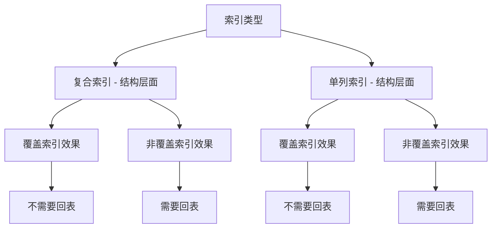

# Left Join

`LEFT JOIN`（左连接）是 SQL 中用于合并两个或多个数据库表的常用操作。它会返回左表（`LEFT JOIN` 左侧的表）中的所有记录，以及右表（`LEFT JOIN` 右侧的表）中与连接条件匹配的记录。

### 基本语法

```sql
SELECT 列名
FROM 左表名
LEFT JOIN 右表名
ON 左表名.公共列 = 右表名.公共列;
```

### 关键特点

1.  **保留左表所有行**：无论右表是否有匹配的行，左表的所有行都会出现在结果集中。
2.  **右表匹配或为空**：
    *   如果右表中有与左表匹配的行，则返回匹配的数据。
    *   如果右表中没有匹配的行，则结果集中右表对应的列会显示为 `NULL`。
3.  **常用于查找“缺失”数据**：例如，找出所有客户（包括没有下过订单的客户）及其订单信息。

### 示例

假设有两个表：

**`customers`** (客户表)
| customer_id | name    |
| ----------- | ------- |
| 1           | Alice   |
| 2           | Bob     |
| 3           | Charlie |

**`orders`** (订单表)
| order_id | customer_id | amount |
| -------- | ----------- | ------ |
| 101      | 1           | 50.0   |
| 102      | 1           | 30.0   |
| 103      | 2           | 20.0   |

执行以下 `LEFT JOIN` 查询：

```sql
SELECT customers.name, orders.amount
FROM customers
LEFT JOIN orders ON customers.customer_id = orders.customer_id;
```

**结果：**
| name    | amount |
| ------- | ------ |
| Alice   | 50.0   |
| Alice   | 30.0   |
| Bob     | 20.0   |
| Charlie | NULL   |

### 与其他 JOIN 的区别

*   **`INNER JOIN`**：只返回两个表中都有匹配的行。
*   **`RIGHT JOIN`**：返回右表的所有行和左表的匹配行（与 `LEFT JOIN` 相反）。
*   **`FULL OUTER JOIN`**：返回左表和右表的所有行，无论是否有匹配（MySQL 不支持，但 PostgreSQL、SQL Server 等支持）。

简单来说，`LEFT JOIN` 的核心就是“**以左表为准，有则匹配，无则为 NULL**”。

# Count

关于 MySQL 中 `count` 的使用，这里详细说明其特性和最佳实践：

## 1. COUNT() 函数的几种形式

### COUNT(*) - 统计总行数
```sql
-- 统计表中所有行数，包括 NULL 值
SELECT COUNT(*) FROM t_article;
```

### COUNT(1) - 统计总行数
```sql
-- 与 COUNT(*) 效果相同，性能基本一致
SELECT COUNT(1) FROM t_article;
```

### COUNT(column) - 统计非空行数
```sql
-- 只统计 article_title 非 NULL 的行数
SELECT COUNT(article_title) FROM t_article;
```

### COUNT(DISTINCT column) - 统计去重后的行数
```sql
-- 统计不重复的分类数量
SELECT COUNT(DISTINCT category_id) FROM t_article;
```

## 2. 性能对比

- **COUNT(\*)** : 最优性能，直接读取索引统计信息
- **COUNT(1)** : 与 COUNT(\*) 性能相近
- **COUNT(column)** : 需要检查每行的 NULL 值，性能较差
- **COUNT(DISTINCT column)** : 性能最差，需要去重计算

## 3. 在你的代码中的应用

### 当前代码分析
```xml
<select id="countArticleAdmins" resultType="java.lang.Integer">
    SELECT count(DISTINCT a.id)
    from t_article a
    LEFT JOIN t_article_tag at on a.id = at.article_id
    <!-- WHERE 条件... -->
</select>
```

### 优化建议

**问题**：使用 `COUNT(DISTINCT a.id)` 是因为 LEFT JOIN 可能产生重复行，但这会影响性能。

**优化方案1**：分离计数逻辑
```xml
<select id="countArticleAdmins" resultType="java.lang.Integer">
    SELECT COUNT(*)
    FROM t_article a
    <where>
        is_delete = #{conditionVO.isDelete}
        <if test="conditionVO.keywords != null">
            and article_title like concat('%',#{conditionVO.keywords},'%')
        </if>
        <if test="conditionVO.status != null">
            and status = #{conditionVO.status}
        </if>
        <if test="conditionVO.categoryId != null">
            and category_id = #{conditionVO.categoryId}
        </if>
        <if test="conditionVO.type != null">
            and type = #{conditionVO.type}
        </if>
        <if test="conditionVO.tagId != null">
            and EXISTS (
                SELECT 1 FROM t_article_tag at 
                WHERE at.article_id = a.id AND at.tag_id = #{conditionVO.tagId}
            )
        </if>
    </where>
</select>
```

**优化方案2**：使用子查询避免JOIN
```xml
<select id="countArticleAdmins" resultType="java.lang.Integer">
    SELECT COUNT(*)
    FROM (
        SELECT a.id
        FROM t_article a
        <if test="conditionVO.tagId != null">
            INNER JOIN t_article_tag at ON a.id = at.article_id
        </if>
        <where>
            is_delete = #{conditionVO.isDelete}
            <if test="conditionVO.keywords != null">
                and article_title like concat('%',#{conditionVO.keywords},'%')
            </if>
            <if test="conditionVO.status != null">
                and status = #{conditionVO.status}
            </if>
            <if test="conditionVO.categoryId != null">
                and category_id = #{conditionVO.categoryId}
            </if>
            <if test="conditionVO.type != null">
                and type = #{conditionVO.type}
            </if>
            <if test="conditionVO.tagId != null">
                and at.tag_id = #{conditionVO.tagId}
            </if>
        </where>
        GROUP BY a.id
    ) temp
</select>
```

## 4. COUNT 使用最佳实践

### 索引优化
确保 COUNT 查询涉及的字段有适当索引：
```sql
-- 组合索引优化 WHERE 条件
CREATE INDEX idx_article_condition ON t_article(is_delete, status, category_id, type);

-- 覆盖索引优化 COUNT 查询
CREATE INDEX idx_article_cover ON t_article(is_delete, status, id);
```

### 避免全表扫描
```sql
-- 不推荐：全表扫描
SELECT COUNT(*) FROM t_article;

-- 推荐：带索引条件
SELECT COUNT(*) FROM t_article WHERE is_delete = 0;
```

### 大表计数优化
```sql
-- 对于大表，考虑使用近似统计
SELECT table_rows FROM information_schema.tables 
WHERE table_schema = 'database_name' AND table_name = 't_article';

-- 或者维护计数表
CREATE TABLE article_count (
    condition_key VARCHAR(50),
    count_value INT,
    update_time TIMESTAMP
);
```

这些优化可以显著提升计数查询的性能，特别是在数据量较大的情况下。

# Group By

很好的问题！让我详细解释GROUP BY的使用原则：

## 📋 GROUP BY 的使用原则

**1. 核心原则：SELECT列表规则**

```sql
-- ✅ 正确：SELECT中的非聚合字段必须在GROUP BY中
SELECT category_id,           -- 非聚合字段，必须在GROUP BY中
       COUNT(1) AS count      -- 聚合函数，不需要在GROUP BY中
FROM t_article
GROUP BY category_id;

-- ❌ 错误：title没有在GROUP BY中
SELECT category_id,           -- 在GROUP BY中 ✓
       title,                 -- 不在GROUP BY中 ❌
       COUNT(1) AS count
FROM t_article
GROUP BY category_id;
```

**2. SQL标准规则**

根据SQL标准，**GROUP BY后的SELECT列表只能包含**：
- GROUP BY子句中的列
- 聚合函数（COUNT、SUM、AVG、MAX、MIN等）
- 常量

## 🤔 GROUP BY 不搭配聚合函数的情况

**场景1：去重（DISTINCT的替代方案）**

```sql
-- 使用GROUP BY去重
SELECT category_id
FROM t_article
GROUP BY category_id;

-- 等价于DISTINCT
SELECT DISTINCT category_id
FROM t_article;
```

**结果**：
```
| category_id |
|-------------|
| 1           |
| 2           |
| 3           |
```

**场景2：多列去重**

```sql
-- 获取唯一的分类-状态组合
SELECT category_id, status
FROM t_article
GROUP BY category_id, status
ORDER BY category_id, status;
```

**结果**：
```
| category_id | status |
|-------------|--------|
| 1           | 1      |
| 1           | 2      |
| 2           | 1      |
| 2           | 3      |
```

**场景3：为后续聚合准备**

```sql
-- 先分组，后续可能添加聚合函数
SELECT user_id, category_id
FROM t_article
WHERE create_time >= '2024-01-01'
GROUP BY user_id, category_id;
```

## ⚠️ 不同数据库的行为差异

**MySQL（5.7之前）：宽松模式**
```sql
-- MySQL 5.7之前允许这样写（但结果不确定）
SELECT id, title, category_id    -- id和title不在GROUP BY中
FROM t_article
GROUP BY category_id;
-- 每组会随机返回一条记录的id和title
```

**MySQL（5.7+）：严格模式**
```sql
-- MySQL 5.7+ 开启sql_mode='ONLY_FULL_GROUP_BY'时会报错
SELECT id, title, category_id
FROM t_article  
GROUP BY category_id;
-- ERROR: Expression #1 of SELECT list is not in GROUP BY clause
```

**PostgreSQL/Oracle：严格遵循SQL标准**
```sql
-- 这些数据库严格要求遵循GROUP BY规则
SELECT category_id, title       -- ❌ title必须在GROUP BY中
FROM t_article
GROUP BY category_id;
-- 会直接报错
```

## 🎯 实际应用示例

**1. 查找每个分类的最新文章**

```sql
-- ❌ 错误写法：
SELECT category_id, title, MAX(create_time)
FROM t_article
GROUP BY category_id;
-- 问题：title可能不是最新文章的title

-- ✅ 正确写法：使用窗口函数
SELECT category_id, title, create_time
FROM (
    SELECT category_id, title, create_time,
           ROW_NUMBER() OVER (PARTITION BY category_id ORDER BY create_time DESC) as rn
    FROM t_article
) ranked
WHERE rn = 1;

-- ✅ 或者使用子查询
SELECT a1.category_id, a1.title, a1.create_time
FROM t_article a1
WHERE a1.create_time = (
    SELECT MAX(a2.create_time)
    FROM t_article a2
    WHERE a2.category_id = a1.category_id
);
```

**2. 合法的GROUP BY不带聚合函数**

```sql
-- 场景：获取用户发布过文章的所有分类
SELECT DISTINCT u.nickname, c.category_name
FROM t_article a
JOIN t_user_info u ON a.user_id = u.id
JOIN t_category c ON a.category_id = c.id
WHERE a.is_delete = 0;

-- 等价写法：
SELECT u.nickname, c.category_name
FROM t_article a
JOIN t_user_info u ON a.user_id = u.id  
JOIN t_category c ON a.category_id = c.id
WHERE a.is_delete = 0
GROUP BY u.nickname, c.category_name;
```

## 📊 GROUP BY的数据库性能考虑

**1. GROUP BY vs DISTINCT**
```sql
-- 性能通常相似，但GROUP BY更灵活
SELECT DISTINCT category_id FROM t_article;
SELECT category_id FROM t_article GROUP BY category_id;

-- GROUP BY可以轻松添加聚合函数
SELECT category_id, COUNT(1) FROM t_article GROUP BY category_id;
```

**2. 索引优化**
```sql
-- 为GROUP BY字段创建索引
CREATE INDEX idx_article_category_status ON t_article(category_id, status);

-- 这样的查询会很快
SELECT category_id, status
FROM t_article
GROUP BY category_id, status;
```

## 💡 最佳实践建议

**1. 明确使用目的**
```sql
-- 如果只是去重，优先使用DISTINCT
SELECT DISTINCT category_id FROM t_article;

-- 如果需要统计，使用GROUP BY + 聚合函数
SELECT category_id, COUNT(1) FROM t_article GROUP BY category_id;
```

**2. 遵循SQL标准**
```sql
-- 推荐：严格遵循GROUP BY规则
SELECT category_id, COUNT(1) as count
FROM t_article
GROUP BY category_id;

-- 而不是依赖数据库的宽松模式
```

**3. 复杂查询使用窗口函数**
```sql
-- 现代SQL推荐使用窗口函数而不是复杂的GROUP BY
SELECT category_id, 
       title,
       create_time,
       COUNT(1) OVER (PARTITION BY category_id) as category_count
FROM t_article;
```

## 📋 总结

**GROUP BY使用原则**：
1. **有聚合函数时**：非聚合字段必须在GROUP BY中
2. **无聚合函数时**：相当于DISTINCT，用于去重
3. **遵循SQL标准**：避免依赖数据库特定行为
4. **考虑性能**：为GROUP BY字段创建合适的索引
5. **复杂场景**：考虑使用窗口函数替代复杂的GROUP BY

> **不是全部，但有严格的规则！** 让我详细解释：
>
> ## 📋 GROUP BY 的精确规则
>
> ### **核心规则：SELECT中的列必须满足以下条件之一**
>
> 1. ✅ **在GROUP BY子句中**
> 2. ✅ **是聚合函数**
> 3. ✅ **是常量**
> 4. ✅ **函数依赖于GROUP BY的列**（MySQL特有）
>
> ## 🎯 具体分析你的SQL
>
> ### **你的表结构**
> ```sql
> CREATE TABLE `t_category` (
>   `id` int NOT NULL AUTO_INCREMENT,           -- 主键
>   `category_name` varchar(20) NOT NULL,       -- 普通字段  
>   `create_time` datetime NOT NULL,            -- 普通字段
>   `update_time` datetime DEFAULT NULL,        -- 普通字段
>   PRIMARY KEY (`id`)                          -- id是主键
> )
> ```
>
> ### **为什么你的SQL可以工作**
>
> ```sql
> SELECT c.id,                    -- ✅ 在GROUP BY中
>        c.category_name,         -- ✅ 函数依赖于c.id（因为id是主键）
>        COUNT(a.id) as article_count  -- ✅ 聚合函数
> FROM t_category c 
> LEFT JOIN t_article a ON c.id = a.category_id 
> GROUP BY c.id;                  -- 按主键分组
> ```
>
> **MySQL的智能识别**：
> - `c.id` 是主键，在GROUP BY中
> - `c.category_name` **函数依赖于** `c.id`
> - 因为：主键确定 → 整行数据确定 → 所有字段确定
>
> ## 🔍 什么是函数依赖？
>
> ### **简单理解**
> ```sql
> -- 如果知道了c.id，就能唯一确定这条记录的所有其他字段
> c.id = 1  →  c.category_name = '技术开发', c.create_time = '2024-01-01', ...
> c.id = 2  →  c.category_name = '生活随笔', c.create_time = '2024-01-02', ...
> ```
>
> ### **MySQL支持的函数依赖情况**
>
> ```sql
> -- ✅ 情况1：GROUP BY包含主键
> SELECT id, category_name, create_time, COUNT(...)
> FROM t_category
> GROUP BY id;  -- id是主键，其他字段自动满足
> 
> -- ✅ 情况2：GROUP BY包含唯一键
> SELECT id, category_name, COUNT(...)
> FROM t_category  
> GROUP BY category_name;  -- 如果category_name有UNIQUE约束
> 
> -- ❌ 情况3：GROUP BY不包含键
> SELECT id, category_name, COUNT(...)
> FROM t_category
> GROUP BY create_time;  -- create_time不是键，id和category_name不确定
> ```
>
> ## 📊 实际测试各种情况
>
> ### **测试1：GROUP BY主键（你的情况）**
> ```sql
> -- ✅ 完全正确
> SELECT c.id, c.category_name, c.create_time, COUNT(a.id)
> FROM t_category c 
> LEFT JOIN t_article a ON c.id = a.category_id 
> GROUP BY c.id;
> -- 因为：c.id(主键) → 其他所有字段都确定
> ```
>
> ### **测试2：GROUP BY非键字段**
> ```sql
> -- ❌ 这会报错（在ONLY_FULL_GROUP_BY模式下）
> SELECT c.id, c.category_name, COUNT(a.id)
> FROM t_category c 
> LEFT JOIN t_article a ON c.id = a.category_id 
> GROUP BY c.create_time;
> -- 因为：create_time不能唯一确定id和category_name
> ```
>
> ### **测试3：所有非聚合字段都在GROUP BY中**
> ```sql
> -- ✅ 总是正确的方法
> SELECT c.id, c.category_name, c.create_time, COUNT(a.id)
> FROM t_category c 
> LEFT JOIN t_article a ON c.id = a.category_id 
> GROUP BY c.id, c.category_name, c.create_time;
> -- 明确指定所有非聚合字段
> ```
>
> ## 🎯 不同数据库的行为
>
> ### **MySQL（函数依赖检测）**
> ```sql
> -- MySQL会检测函数依赖关系
> GROUP BY primary_key;  -- ✅ 其他字段自动满足
> GROUP BY unique_key;   -- ✅ 其他字段自动满足
> GROUP BY normal_field; -- ❌ 其他字段需要明确指定
> ```
>
> ### **PostgreSQL/Oracle（严格模式）**
> ```sql
> -- 必须明确指定所有非聚合字段
> SELECT col1, col2, COUNT(*)
> FROM table
> GROUP BY col1;         -- ❌ 错误，col2必须在GROUP BY中
> 
> SELECT col1, col2, COUNT(*)
> FROM table  
> GROUP BY col1, col2;   -- ✅ 正确
> ```
>
> ## 💡 实用建议
>
> ### **1. 最安全的做法（兼容所有数据库）**
> ```sql
> -- 把所有非聚合字段都放入GROUP BY
> SELECT c.id, c.category_name, c.create_time, COUNT(a.id)
> FROM t_category c 
> LEFT JOIN t_article a ON c.id = a.category_id 
> GROUP BY c.id, c.category_name, c.create_time;
> ```
>
> ### **2. 利用MySQL的函数依赖（推荐）**
> ```sql
> -- GROUP BY主键，让MySQL自动处理
> SELECT c.id, c.category_name, c.create_time, COUNT(a.id)
> FROM t_category c 
> LEFT JOIN t_article a ON c.id = a.category_id 
> GROUP BY c.id;  -- 简洁且高效
> ```
>
> ### **3. 检查你的SQL模式**
> ```sql
> -- 查看当前模式
> SELECT @@sql_mode;
> 
> -- 如果包含ONLY_FULL_GROUP_BY，规则更严格
> -- 如果不包含，MySQL会比较宽松（但不推荐依赖）
> ```
>
> ## 📋 总结回答你的问题
>
> **不是所有非聚合字段都必须加入GROUP BY**，正确的规则是：
>
> ✅ **必须在GROUP BY中的情况**：
> - 非聚合字段
> - 不能通过函数依赖确定的字段
>
> ✅ **不需要在GROUP BY中的情况**：
> - 聚合函数（COUNT、SUM等）
> - 常量值
> - **函数依赖于GROUP BY字段的列**（如主键依赖）
>
> **你的SQL能工作是因为**：
> - `GROUP BY c.id` 中，`c.id`是主键
> - `c.category_name`等其他字段**函数依赖**于主键`c.id`
> - MySQL智能识别了这种依赖关系
>
> **建议**：继续使用`GROUP BY c.id`，这是最优雅和高效的写法！


# 窗口函数

## 1. 排名函数

用于为行分配排名。

| 函数             | 说明                             | 示例结果 (值相同)  |
| :--------------- | :------------------------------- | :----------------- |
| `ROW_NUMBER()`   | 行号，**唯一连续**               | 1, 2, 3, 4         |
| `RANK()`         | 相同值排名相同，**跳过后续名次** | 1, 1, 3, 4         |
| `DENSE_RANK()`   | 相同值排名相同，**不跳过名次**   | 1, 1, 2, 3         |
| `PERCENT_RANK()` | 百分比排名 `(rank-1)/(rows-1)`   | 0.0, 0.0, 0.5, 1.0 |

```sql
SELECT 
    name, score,
    ROW_NUMBER() OVER (PARTITION BY parents ORDER BY score) AS rrank,
    RANK() OVER (ORDER BY score DESC) AS rank,
    DENSE_RANK() OVER (ORDER BY score DESC) AS dense_rank
FROM students;
```


## 2. 分析函数

| 函数                     | 说明                                                         |
| :----------------------- | :----------------------------------------------------------- |
| `NTILE(n)`               | 将分区内的行划分为 `n` 个大致相等的桶（如四分位）            |
| `CUME_DIST()`            | 累积分布：当前行及之前行数 / 分区总行数                      |
| `LAG(expr, N, default)`  | 获取当前行**之前**第 N 行的值（默认 N=1）                    |
| `LEAD(expr, N, default)` | 获取当前行**之后**第 N 行的值                                |
| `FIRST_VALUE(expr)`      | 返回窗口中第一行的指定表达式值                               |
| `LAST_VALUE(expr)`       | 返回窗口中**当前行范围内的最后一行**值（常需配合 `ROWS/RANGE`） |
| `NTH_VALUE(expr, N)`     | 返回窗口中第 N 行的值                                        |


## 3. 聚合函数

任何聚合函数都可以用作窗口函数（只需加上 `OVER()`）。

| 函数                | 说明           |
| :------------------ | :------------- |
| `SUM() OVER(...)`   | 窗口内累计和   |
| `AVG() OVER(...)`   | 窗口内移动平均 |
| `COUNT() OVER(...)` | 窗口内行数计数 |
| `MIN() OVER(...)`   | 窗口内最小值   |
| `MAX() OVER(...)`   | 窗口内最大值   |

```sql
SELECT 
    product, sales, month,
    SUM(sales) OVER (PARTITION BY product) AS total_sales, -- 产品总销量
    AVG(sales) OVER (PARTITION BY product ORDER BY month ROWS 2 PRECEDING) AS moving_avg -- 3月移动平均
FROM monthly_sales;
```


# 分页


# MySQL JSON 类型使用总结


本文档总结了关于 MySQL `JSON` 数据类型的推出时间、核心用法、生成列（Generated Columns）的原理与选择，以及相关注意事项。

## 1. MySQL JSON 类型的推出时间

- **推出版本**：MySQL 5.7
- **具体版本**：从 **MySQL 5.7.8** 开始正式引入原生 `JSON` 数据类型。
- **主要特性**：
  - 自动验证 JSON 格式。
  - 以优化的内部格式存储，提升读取效率。
  - 提供丰富的 JSON 操作函数和操作符（如 `->`, `->>`, `JSON_EXTRACT`, `JSON_SET` 等）。

---

## 2. JSON 类型的核心 SQL 用法

### 2.1 创建表
```sql
CREATE TABLE users (
    id INT AUTO_INCREMENT PRIMARY KEY,
    name VARCHAR(100),
    config JSON,  -- 定义 JSON 类型列
    created_at TIMESTAMP DEFAULT CURRENT_TIMESTAMP
);
```

### 2.2 插入数据
```sql
INSERT INTO users (name, config) VALUES 
('Alice', '{
    "theme": "dark",
    "preferences": {
        "language": "en",
        "timezone": "UTC"
    },
    "tags": ["developer"]
}');
```

### 2.3 查询数据
- **`->`**: 提取 JSON 值，结果包含引号（JSON 格式）。
- **`->>`**: 提取 JSON 值并去除引号，返回纯文本，便于比较。

```sql
-- 提取 theme（带引号）
SELECT name, config -> '$.theme' AS theme FROM users;

-- 提取 language（纯文本，推荐用于 WHERE）
SELECT name, config ->> '$.preferences.language' AS lang FROM users;

-- 条件查询
SELECT name FROM users WHERE config ->> '$.theme' = 'dark';
```

### 2.4 修改 JSON 数据
```sql
-- 更新或插入字段
UPDATE users SET config = JSON_SET(config, '$.theme', 'blue') WHERE name = 'Alice';

-- 删除字段
UPDATE users SET config = JSON_REMOVE(config, '$.tags') WHERE name = 'Alice';
```

---

## 3. 生成列 (Generated Columns) 加速查询

### 3.1 为什么需要生成列？
- **问题**：无法直接在 `JSON` 列的内部字段上创建 B-Tree 索引。
- **解决方案**：创建一个**生成列**，将 JSON 内部的值提取出来，变成普通列，然后为该列创建索引。

### 3.2 生成列语法
```sql
ADD COLUMN <新列名> <数据类型> 
GENERATED ALWAYS AS (<表达式>) [STORED | VIRTUAL]
```

### 3.3 示例：为 JSON 字段创建索引
```sql
-- 1. 创建 STORED 生成列（推荐）
ALTER TABLE users 
ADD COLUMN lang VARCHAR(10) 
GENERATED ALWAYS AS (config ->> '$.preferences.language') STORED;

-- 2. 在生成列上创建索引
CREATE INDEX idx_lang ON users(lang);

-- 3. 高效查询（可使用索引）
SELECT name FROM users WHERE lang = 'en';
```

> **关键**：使用 `->>` 操作符去除引号，使值适合字符串比较。

---

## 4. STORED vs VIRTUAL 生成列

| 特性           | `STORED`           | `VIRTUAL`              |
| :------------- | :----------------- | :--------------------- |
| **存储**       | 物理存储在磁盘     | 不存储，查询时动态计算 |
| **读取性能**   | ⚡ 极快             | ⏱️ 稍慢（需计算）       |
| **写入性能**   | 🐢 稍慢（需写入值） | ⚡ 快                   |
| **磁盘空间**   | 💾 占用空间         | ✅ 零额外空间           |
| **能否被索引** | ✅ 可以             | ✅ 可以 (MySQL 5.7.8+)  |
| **能否为主键** | ✅ 可以             | ❌ 不可以               |

### 4.1 使用场景推荐
- **`STORED`**:
  - 查询非常频繁，且需要高性能。
  - 表达式计算开销大（如复杂 JSON 提取）。
  - 需要被外键引用或作为主键。
  - **JSON 字段提取场景的首选**。

- **`VIRTUAL`**:
  - 磁盘空间紧张，表非常大。
  - 表达式计算非常轻量（如 `DATE(datetime_col)`）。
  - 该列很少被查询。
  - 写入性能是首要瓶颈。

## 结论与建议

1. **使用 `JSON` 类型**：适用于存储半结构化数据（配置、日志、动态属性）。
2. **善用 `->>`**：在 `WHERE` 子句中优先使用 `->>` 获取纯文本值进行比较。
3. **必须使用生成列+索引**：这是提升 JSON 内部字段查询性能的**唯一高效途径**。
4. **优先选择 `STORED`**：在 JSON 提取场景下，`STORED` 生成列能提供最佳的查询性能和稳定性。


# 索引

- 覆盖索引 : 查询所需的所有字段都包含在索引中，MySQL可以完全通过索引获取数据，而无需回表查询实际数据行。

  **场景： 文章列表查询优化**

  原始查询：

  ```sql
  SELECT id, article_title, status, create_time, is_top, is_featured 
  
  FROM t_article WHERE status IN (1,2) AND is_delete = 0 
  
  ORDER BY is_top DESC, is_featured DESC, create_time DESC
  ```

  建立覆盖索引：

  ```sql
  CREATE INDEX IDX_ARTICLE ON t_article (
  	id,  -- SELECT 字段
      article_title, -- SELECT 字段
      create_time, -- ORDER BY 字段
      is_top, -- ORDER BY 字段
      is_featured, -- ORDER BY 字段
      status, -- where 字段
      is_delete -- where 字段
  )
  ```

  

- 前缀索引 : 前缀匹配，如果是`'%SQL%' `或`'%SQL'`，一般需要用到其他INDEX，例如覆盖索引

  ```sql
  CREATE INDEX IDX_PREFIX_ARTICLE_TITLE ON t_article(article_title(20))
  ```

  示例:

  ```sql
  SELECT article_title from t_article where article_title LIKE 'SQL%'
  ```

  

- 复合索引 : 包含覆盖索引和非覆盖索引

  ```sql
  CREATE INDEX IDX_ARTICLE_STATUS_TIME ON t_article(status, is_delete, create_time DESC);
  ```

  

- 索引监控:

  




# 锁

**MDL - Meta Data Lock 锁 (元数据锁)**：保护的是**表结构（Schema）**。它确保在你读取或修改数据的过程中，表的结构（比如列名、列类型、索引）不会突然改变或消失。
